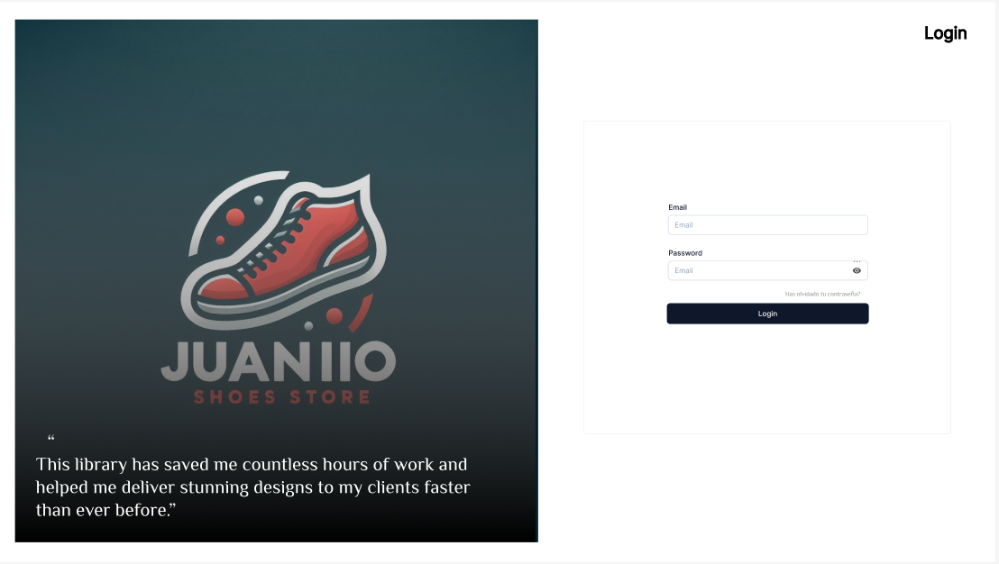
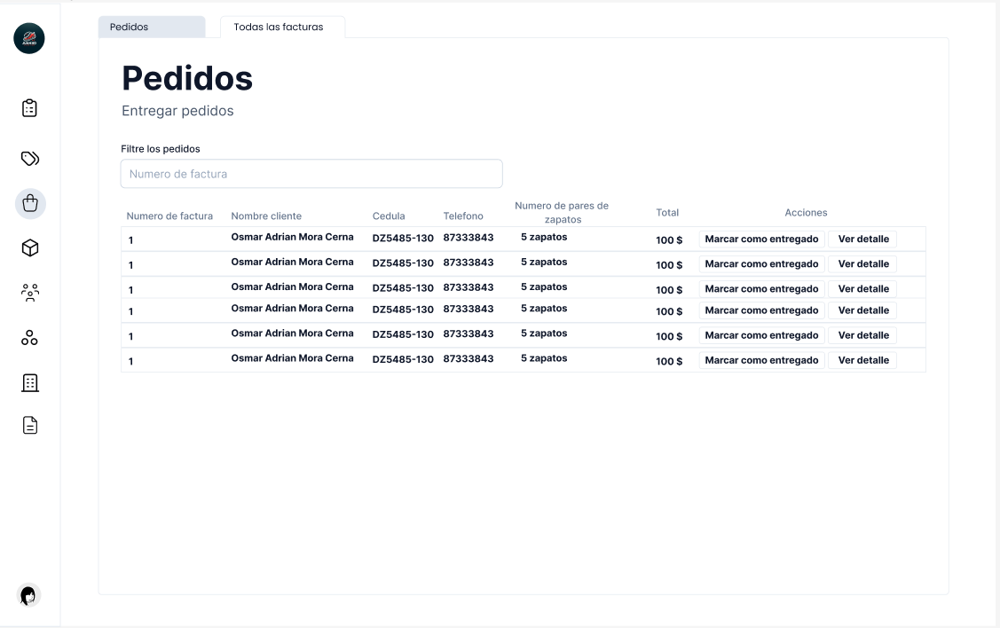

<div align="center"> 
    <h1>Juanito Shoes Web App</h1>
</div>

<div align="center"> 
   
   
   
   

</div>

# Descripción

Este repositorio contiene el proyecto final de la clase de Desarrollo Web denominado Juanito Shoes, una empresa dedicada a la venta de calzado. La aplicación desarrollada tiene como objetivo principal simplificar el proceso de recepción de pedidos a través de una Aplicacion Web, agilizando así la gestión y mejorando la eficiencia operativa.

# Vista previa

| <center><b>Galeria</b></center> |
| ------------------------------------------------------------------------------------------------------------------ |
|  |
|  |

# Guia de instalación

Para comenzar con "juanito_shoes_WebApp_refactor", siga estos sencillos pasos de instalación:

1. **Abre tu terminal:**
   Comience abriendo su terminal o símbolo del sistema.

2. **Clonar el repositorio:**
   Utilice el siguiente comando para clonar el repositorio del proyecto y navegar al directorio del proyecto:

   ```sh
   https://github.com/osmarmora05/juanito_shoes_WebApp_refactor.git && cd juanito_shoes_WebApp_refactor
   ```

3. **Instala las dependencias:**

    ```sh
    npm install
    ```

4. **Establece las variables de entorno:**

    Deberas crear dentro del directorio del proyecto el siguiente archivo: `.env.local` con el siguiente contenido:

    ```JavaScript
    VITE_PB_URL="*****"
    ```

    Para obtener el valor de `VITE_PB_URL` ponte en conctato conmigo

5. **Pon en marcha el proyecto:**
    ```sh
    npm run dev
    ```

# Tecnologias

<div style="display: flex; flex-direction: row; width: 100%; gap: 10px">


</div>